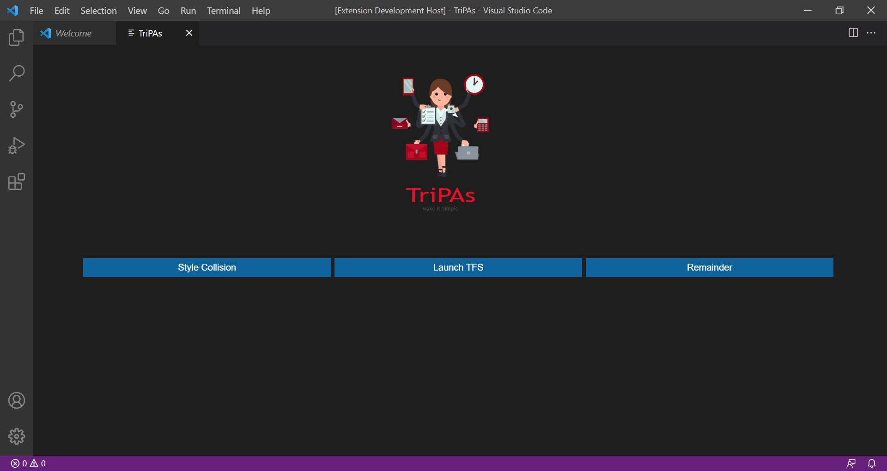

# TriPAs - Make it Simple

## Demo

## To Run the Application Execute following command

- Open this example in VS Code 1.47+
- `npm install`
- `npm run watch` or `npm run compile`
- `F5` to start debugging

Run the `TriPAs: Make it Simple` to create the webview.
